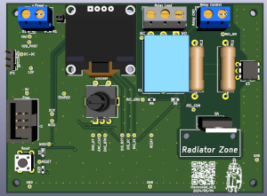
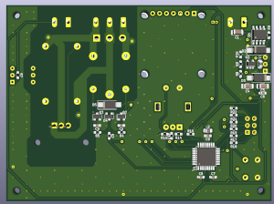
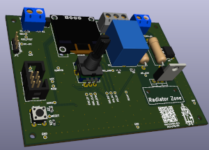

# Thermostat:  
A board for connecting an inductive load (the width of the tracks allows you  
to connect up to 5A); if large currents are required, then a connector is  
provided for connecting control signals of an external relay (Relay Control).  
Scheme was made using the [article](https://habr.com/ru/companies/unwds/articles/390601/).  

### Schemes:  
###### thermostat_v0.1:  
[pdf](docs/thermostat_v0.1.pdf)  

### Images:  
###### thermostat_v0.1:  
top:  
  
bottom:  
  
assembly:  
  

###### gerber:  
Archive for production:  
[thermostat_v0.1](https://github.com/piro-s/thermostat/raw/main/gerber/thermostat_v0.1.zip)  